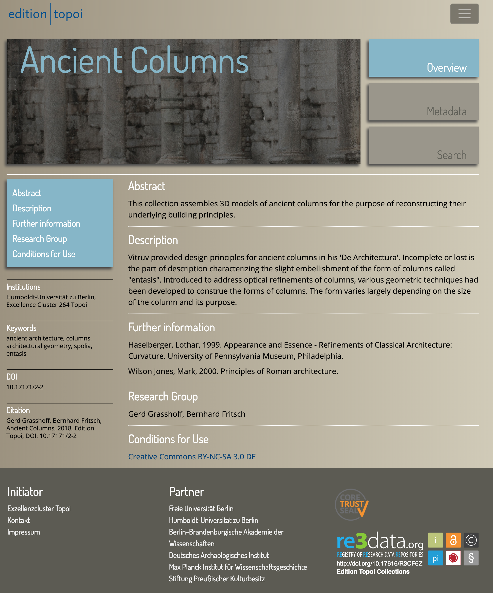
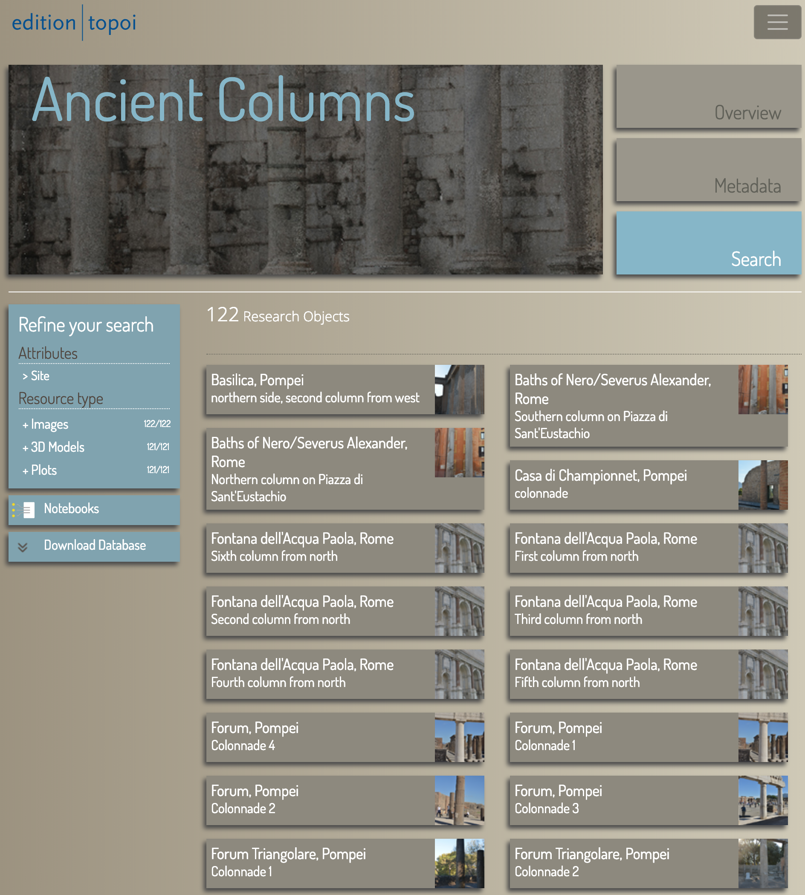
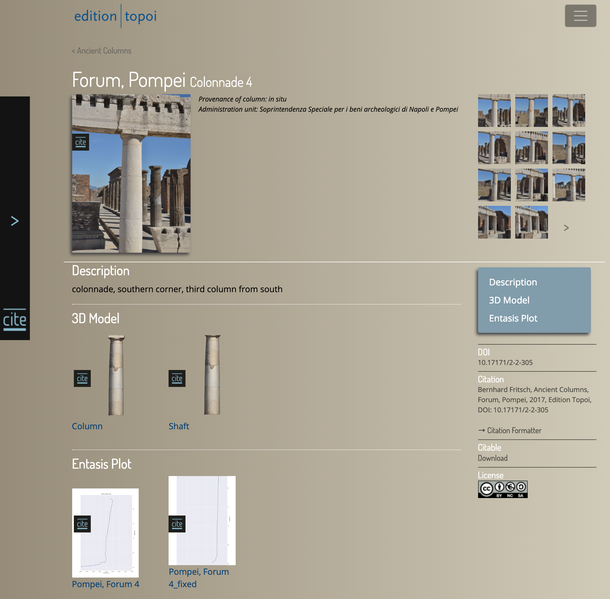

# Zielsetzung
Diese Datei beschreibt den Zusammenhang zwischen den sichtbaren Projektseiten, die den Repositorien Inhalt und den key:values, die in den jeweiligen Dateien den Inhalt festlegen. Die HTML Projektseiten werden abgebildet und tragen einzelnen keys, die als Anker für die Beschreibungen der key:values diesen. Die Dateien haben entweder das Format von JSON oder von jaml Dateien.

# Project page

# Search page

# Research object page

